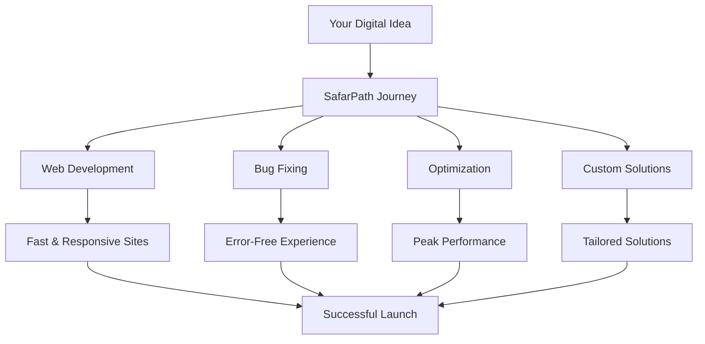

    
# 🌐 SafarPath - Digital Development & Innovation Studio  
 
> *Guiding your digital journey with clarity, creativity, and confidence*  
  
[](https://safarpath.qzz.io/)
[](https://wa.me/923127592672)
[](https://www.instagram.com/safarpath)
[](https://www.facebook.com/SafarPath)
[](https://orcid.org/0009-0000-8992-7440)


## 🧭 About SafarPath

SafarPath is a digital development and innovation studio dedicated to guiding individuals and businesses through their online journey. Our name blends two powerful ideas — **"Safar"** (meaning journey in Urdu/Arabic) and **"Path"** — symbolizing direction, progress, and purpose in the digital world.

At SafarPath, we believe every website, every project, and every idea represents a new journey — and our mission is to help you travel that path with clarity, creativity, and confidence.

### 💡 Our Vision
> To become a trusted companion for every brand's digital journey — delivering solutions that empower growth, ensure stability, and inspire innovation.

### 🎯 Our Mission
> To craft modern, reliable, and scalable digital experiences by combining creativity, technology, and precision. We aim to turn challenges into smooth digital paths — one project at a time.

## ⚙️ Services We Offer

| Service | Description | Technologies |
|---------|-------------|--------------|
| **🌐 Website Development** | From idea to launch, we build fast, responsive, and user-focused websites | HTML5, CSS3, JavaScript, React, Node.js |
| **🐛 Bug Fixing & Error Resolution** | Diagnosing and fixing performance, UI, and security issues quickly | Debugging, Testing, Performance Optimization |
| **⚡ Optimization & Maintenance** | Keep your site running smoothly with expert optimization and continuous care | SEO, Performance, Security Updates |
| **🎨 Custom Solutions** | Tailored designs, dashboards, or tools built to match your unique vision | Custom Development, UI/UX Design |

## 🚀 Quick Start

### Get Your Project Started
```bash
# Contact us for your digital journey
📞 WhatsApp: +92 312 7592672
🌐 Website: https://safarpath.qzz.io
```

### Our Development Process
1. **Discovery** - Understanding your vision and requirements
2. **Strategy** - Planning the optimal path forward
3. **Development** - Building with precision and creativity
4. **Testing** - Ensuring quality and performance
5. **Launch** - Deploying your digital solution
6. **Support** - Ongoing maintenance and improvements

## 🌟 Why Choose SafarPath

- ✅ **Journey-Oriented Approach** - We see your project as a journey, not just a task
- ✅ **Technical Excellence** - Combining expertise with creative strategy
- ✅ **Clear Communication** - Transparent process and regular updates
- ✅ **Quick Turnaround** - Efficient development without compromising quality
- ✅ **Lasting Support** - We grow alongside you with continuous support

## 📊 Our Expertise




## 📞 Connect With Us

<div align="center">

[](https://safarpath.qzz.io/)
[](https://wa.me/923127592672)
[](https://www.instagram.com/safarpath)
[](https://www.facebook.com/SafarPath)
[](https://orcid.org/0009-0000-8992-7440)

</div>

## 🛠️ Technology Stack

### Frontend Development


### Backend & Tools


## 📈 Project Statistics


## ✨ Our Essence

> **"Digital journeys should be meaningful, beautiful, and seamless."**

At SafarPath, every pixel, every line of code, and every project reflects our core belief in creating digital experiences that matter. We don't just build websites; we craft digital journeys that help businesses grow and thrive in the online world.

---

<div align="center">

### **Ready to Start Your Digital Journey?**
[](https://wa.me/923127592672)

*Let's build something amazing together!* 🚀

**SafarPath - Your Digital Journey Companion**

</div>
